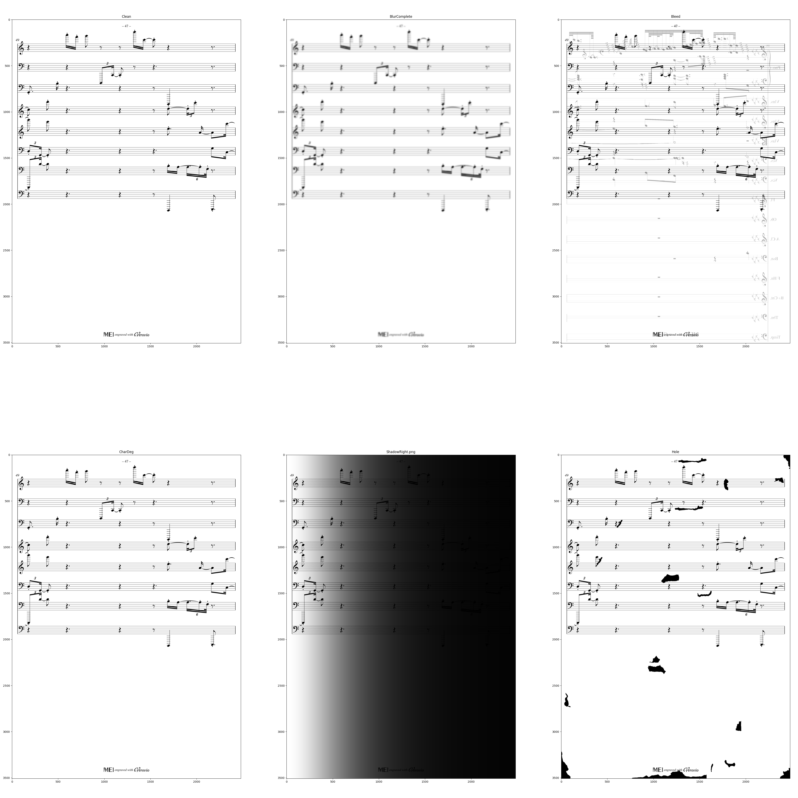
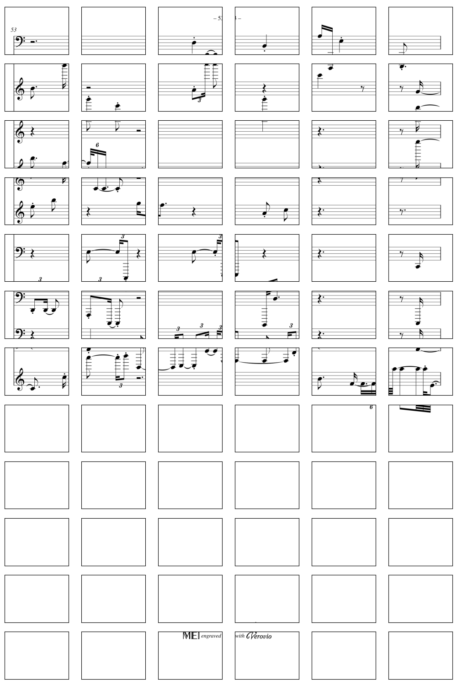
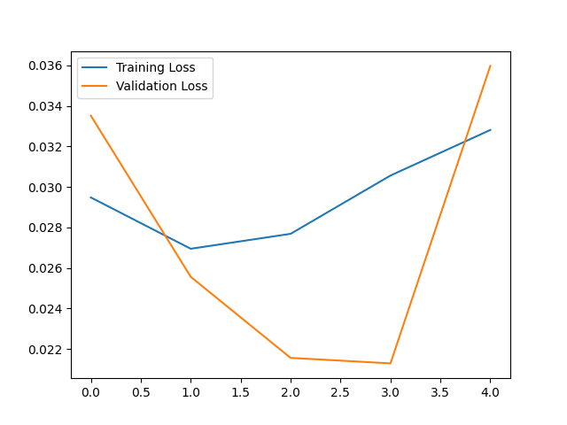

# Deep Learning Music Scores Restoration 🎼 🖥️

Topic: `Computer Vision` 
<br>
Type: `Image Generation / Image Transformation`
<br>
Error Metric: `Mean Squared Error`
<br>
Target Score: `Better than Baselines (specified in a later section)`

This project aims to restore damaged/ dirty music scores using deep learning methods. 
We use **Convolutional Autoencoder** to perform several generative AI tasks to **up-scale**, 
**deblur** and **enrich** dirty music score into a cleaner and more readable form. 

## Dataset 

To train the model, we generated a huge dataset of clean music scores by rendering [MusicXML](https://de.wikipedia.org/wiki/MusicXML) 
files into svg files by using the [Verovio Python interface](https://pypi.org/project/verovio/). 
Using the [INKSCAPE](https://inkscape.org/de/) CLI tools, we convert the svg files into png files.  

We used the licence-free MusicXML files from [MScoreLib](http://mscorelib.com/actree/). Furthermore, 
we generated MusicXML files randomly. This enables a limitless scaling of the training data.
We generated the random scores using the [Python SCAMP library](http://scamp.marcevanstein.com/index.html).  

Here we provide some example MusicXMLs and the rendered sheets:


In case you are wondering how the random music sounds like,
we've created an [audio file](assets/ds_creation/RandomMusic.mp3):

https://github.com/HackerBschor/dl-music-scores-restoration/assets/33778754/1dee12ec-d101-45de-85f4-2464b57a5784

To create the dirty images, we use the data augmentation tool [DocCreator](https://doc-creator.labri.fr/).
We used the following augmentations resulting in four dirty images for a clean image: 

| Augmentation                              | Min | Max  |
|-------------------------------------------|-----|------|
| Character Degeneration                    | 90% | 100% |
| Bleed Through                             | 50% | 99%  |
| Blur (Whole Page)                         | 80% | 100% |
| Hole                                      | 16% | 32%  |
| Shadow Binding (Left, Right, Top, Bottom) |     |      |

We used the following Shadow Binding parameters:
* width: 100%
* intensity: 96%
* angle: 9%



### Dataset Generation

To create a dataset, one can use the [Dataset Creation Pipeline](dataset_creation/dataset_creation.ipynb).
One has to provide the paths to the MusicXML files and the path to the output directory.

After the creation of the clean sheets, 
one has to use the data augmentation tool [DocCreator](https://doc-creator.labri.fr/)
to create the dirty images.

We separately saved the clean and the dirty images (in our case: `pairs`). 
From there on, 
we created the index for later identification using the second path of the [Dataset Creation Pipeline](dataset_creation/dataset_creation.ipynb).

Here we provide an example file structure which is used by the pipelines:
```
📂 dataset
├── 📂 existing
│   ├── 📂 musicxml
│   │   ├── Mozart
│   │   │   ...
│   │   │   └── 📜 Very Famous Composition.mxl
│   │   ...
│   │   └── 📜 Mr. Brightside – The Killers.mxl
│   ├── 📂 render_png
│   └── 📂 render_svg
├── 📂 generated
│   ├── 📂 musicxml
│   ├── 📂 render_png
│   └── 📂 render_svg
└── 📂 pairs
    ├── 📂 clean
    ├── 📂 dirty
    └── 📜 clean_dirty_index.csv
```

## Preprocessing

In order to keep the VRAM usage in a decent scale, we cut the Image into smaller pieces of size 416px X 308px.
We chose this resolution, since it corresponds approximately to the DINA4 resolution. 
Furthermore, both resolution axis have to be dividable by four in order to get a same sized image
(Because the encoder halve the image two times and the decoder then doubles it two times).


## Training

Using the dirty and the non-dirty music scores of the training set, 
we trained a model on the clean scores and took the dirty ones as input.

We've tried different architectures
(e.g. [Hybrid Attention Transformer for Image Super-Resolution](https://arxiv.org/abs/2205.04437v3)
or combining two approaches), but due to the size of the images and therefore the high dimensionality,
we had some issues to train a model.  

We came up with a [new model](dl/src/model.py)
by modifying the [Denoising Documents Autoencoder](https://github.com/Surya-Prakash-Reddy/Denoising-Documents).
We modernized the PyTorch calls, added an [Upsample](https://pytorch.org/docs/stable/generated/torch.nn.Upsample.html) 
unit and changed the final activation function
([Sigmoid](https://pytorch.org/docs/stable/generated/torch.nn.Sigmoid.html) &#8594;
[Tanh](https://pytorch.org/docs/stable/generated/torch.nn.Tanh.html)).   

We trained the model in the [Training Pipeline](dl/training_full.ipynb) notebook using 
36802 sheets (13.3 GB) with 5 augmentations each (184010 sheets and 80.9 GB) on 6 epochs. 

The following images shows the training- & validation-losses during training in order to ensure there is no overfitting 
(The first epoch is not included due to a crash).


## Loss Function and Baseline

### MSE
Since evaluating generative AI can be quite challenging, we came up with different baselines by evaluating the 
[MSE](https://pytorch.org/docs/stable/generated/torch.nn.MSELoss.html) on different outputs.  

We experimented with different loss functions, but MSE turned out to produce the best results.  

* Returning the dirty image with no transformations ([Mock Baselines Pipeline](dl/mock_baselines.ipynb))
  * Here we mock a model that is "untrained"
* Returning a completely white Image ([Mock Baselines Pipeline](dl/mock_baselines.ipynb))
  * For this baseline, we mock a model that collapsed and learned that returning white images is the best solution.
  This happened quite sometimes during the refinement of the architecture, 
  because a major part of the sheet is often white
* Returning a random image ([Mock Baselines Pipeline](dl/mock_baselines.ipynb))

## Results

### MSE 
| White Image | Dirty Image | Random Image | Model |
|:-----------:|:-----------:|:------------:|:-----:|
|    0.138    |    0.489    |    0.392     | 0.047 |


One can explore the predictions in some [examples](assets/predictions).

## Tests

We tested the model on some real-world examples and a [Test Image](assets/tests/input/test_image.png)
to understand what the model is doing. 
We stored the images and predictions in the [assets folder](assets/tests). 

Here we found out that the model is surprisingly good at removing the watermarks 
([Watermarked Image](assets/tests/input/9784025-old-music-note-sheet.jpg), [Output](assets/tests/prediction/9784025-old-music-note-sheet.jpg)).

## Future Work
In the future, 
we think of fine-tuning the model using real scans of old used music sheets and brand-new ones.

## Installation 

## Training
To run the data generation pipeline, one has to install [inkscape](https://inkscape.org/de/).
We recommend installing PyTorch using their [guide](https://pytorch.org/get-started/locally/).

```console
pip3 install -r requirements.txt
```

## Deployment

To build and run a user-friendly application, you have to install 
[Docker](https://www.docker.com/) and run the following commands.  
```console
cd deliver
docker build -t music-scores-restoration .
docker run -p 127.0.0.1:5000:5000 music-scores-restoration
```

```console
pip3 install -r requirements.txt
```

## References
* [Denoising Text Image Documents using Autoencoders](https://www.researchgate.net/publication/356423394_Denoising_Text_Image_Documents_using_Autoencoders)
* [Denoising GitHub](https://github.com/Surya-Prakash-Reddy/Denoising-Documents)
* [Hybrid Attention Transformer for Image Super-Resolution](https://arxiv.org/abs/2205.04437v3)
* [HAT Github](https://github.com/XPixelGroup/HAT)
* [Image Super-Resolution Using Deep Convolutional Networks](https://arxiv.org/abs/1501.00092)
* [CNN Github](https://github.com/amanshenoy/image-super-resolution)


## Work Breakdown

In the following table, we break down the tasks and the
estimated amount of time needed to complete them. 

| Task               | Time                   |
|--------------------|------------------------|
| Research           | 1.5 Days               |
| Dataset Generation | 2 Day                  |
| Model Creation     | 4 Days                 |
| Model Training     | 5 Day (no work for me) |
| Model Evaluation   | 0.5 Days               |
| Deployment         | 1 Day                  |


### Disclaimer
This repository is created by Nicolas Bschor as part of 
the Applied Deep Learning course at the Technical University of Vienna.
