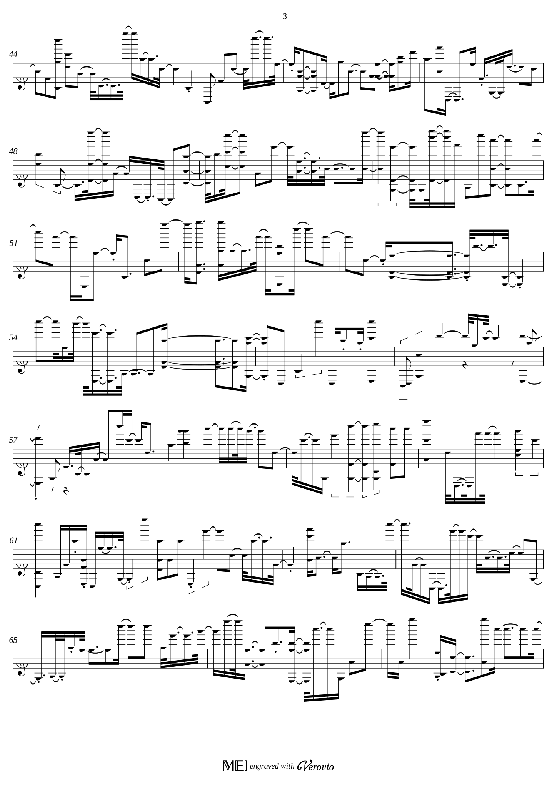

# Deep Learning Music Scores Restoration 🎼 🖥️

Topic: `Computer Vision` 
 
Type: `Image Generation / Image Transformation`

This project aims to restore damaged music scores using deep learning methods. 
We use **Convolutional Autoencoder** to perform several generativ AI tasks to **up-scale**, 
**deblur** and **enrich** damaged music score into a cleaner and more readable form. 

### Dataset 

To train the model, we generated a huge dataset of clean music scores by rendering [MusicXML](https://de.wikipedia.org/wiki/MusicXML) 
files into svg files by using the [Verovio Python interface](https://pypi.org/project/verovio/). 
Using the [INKSCAPE](https://inkscape.org/de/) CLI tools, we convert the svg files into png files.  

We used the licence-free MusicXML files from [MScoreLib](http://mscorelib.com/actree/). Furthermore, 
we generated MusicXML files randomly. This enables a limitless scaling of the training data.
We generated the random scores using the [Python SCAMP library](http://scamp.marcevanstein.com/index.html).  

Here we provide some example MusicXMLs and the rendered sheets: 
* Left: Random Music ([MusicXML](examples/RandomMusic.xml))
* Right: Mozart: Overture of 'Don Giovanni' ([MusicXML](examples/Mozart-Don_Giovanni.xml))

        
    

In case you are wondering how the random music sounds like,
we've created an [audio file](examples/RandomMusic.mp3):

https://github.com/HackerBschor/dl-music-scores-restoration/assets/33778754/1dee12ec-d101-45de-85f4-2464b57a5784

To create the dirty images, we use the data augmentation tool [DocCreator](https://doc-creator.labri.fr/).
We used the following degenerations resulting in 4 dirty images for one clean image : 

| Task                   | Min | Max  |
|------------------------|-----|------|
| Character Degeneration | 90% | 100% |
| Bleed Through          | 50% | 99%  |
| Blur (Whole Page)      | 80% | 100% |
| Hole                   | 16% | 32%  |

### Training

Using the damaged and the non-damaged music scores of the training set, 
we will train a model on the 'perfect' scores and use the damaged ones as input.
We aim to combine several different approaches to denoise the images ([Autoencoders](https://www.researchgate.net/publication/356423394_Denoising_Text_Image_Documents_using_Autoencoders) ) 
and upscale / sharpen them 
([Hybrid Attention Transformer](https://arxiv.org/abs/2205.04437v3) / [Convolutional Networks](https://arxiv.org/abs/1501.00092) 
for super-resolution and deblurring).
We intend to use PyTorch to combine / implement the method and train it end-to-end.

### Future Work
In the future, 
we think of fine-tuning the model using real scans of old used music sheets and brand-new ones.

## References
* [Denoising Text Image Documents using Autoencoders](https://www.researchgate.net/publication/356423394_Denoising_Text_Image_Documents_using_Autoencoders)
* [Denoising GitHub](https://github.com/Surya-Prakash-Reddy/Denoising-Documents)
* [Hybrid Attention Transformer for Image Super-Resolution](https://arxiv.org/abs/2205.04437v3)
* [HAT Github](https://github.com/XPixelGroup/HAT)
* [Image Super-Resolution Using Deep Convolutional Networks](https://arxiv.org/abs/1501.00092)
* [CNN Github](https://github.com/amanshenoy/image-super-resolution)

## Work Breakdown structure

In the following table, we break down the tasks and the
estimated amount of time needed to complete them. 

| Task                  | Estimated Time         |
|-----------------------|------------------------|
| Research              | 2 Days                 |
| Dataset Generation    | 1 Day                  |
| Model Creation        | 3 Days                 |
| Model Training        | 1 Day (no work for me) |
| Model Evaluation      | 1 Days                 |
| Integration           | 2 Days                 |
| Report & Presentation | 1 Day                  |

### Disclaimer
This repository is created by Nicolas Bschor as part of 
the Applied Deep Learning course at the Technical University of Vienna.
