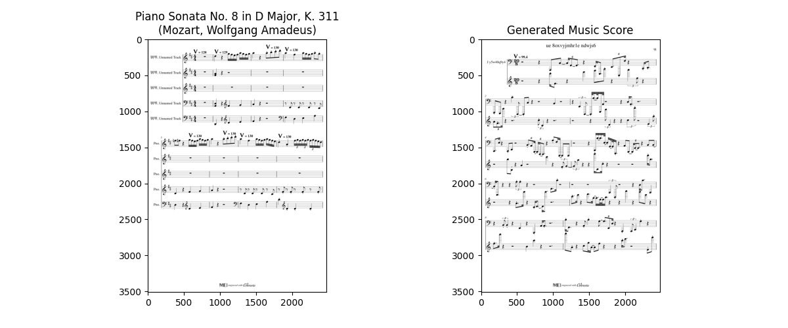

# Deep Learning Music Scores Restoration 🎼 🖥️

Topic: `Computer Vision` 
<br>
Type: `Image Generation / Image Transformation`
<br>
Error Metric: `Mean Squared Error`
<br>
Target Score: `Better than Baselines (specified in a later section)`

This project aims to restore damaged music scores using deep learning methods. 
We use **Convolutional Autoencoder** to perform several generative AI tasks to **up-scale**, 
**deblur** and **enrich** damaged music score into a cleaner and more readable form. 

## Dataset 

To train the model, we generated a huge dataset of clean music scores by rendering [MusicXML](https://de.wikipedia.org/wiki/MusicXML) 
files into svg files by using the [Verovio Python interface](https://pypi.org/project/verovio/). 
Using the [INKSCAPE](https://inkscape.org/de/) CLI tools, we convert the svg files into png files.  

We used the licence-free MusicXML files from [MScoreLib](http://mscorelib.com/actree/). Furthermore, 
we generated MusicXML files randomly. This enables a limitless scaling of the training data.
We generated the random scores using the [Python SCAMP library](http://scamp.marcevanstein.com/index.html).  

Here we provide some example MusicXMLs and the rendered sheets:


In case you are wondering how the random music sounds like,
we've created an [audio file](assets/ds_creation/RandomMusic.mp3):

https://github.com/HackerBschor/dl-music-scores-restoration/assets/33778754/1dee12ec-d101-45de-85f4-2464b57a5784

To create the dirty images, we use the data augmentation tool [DocCreator](https://doc-creator.labri.fr/).
We used the following degenerations resulting in 4 dirty images for a clean image: 

| Task                   | Min | Max  |
|------------------------|-----|------|
| Character Degeneration | 90% | 100% |
| Bleed Through          | 50% | 99%  |
| Blur (Whole Page)      | 80% | 100% |
| Hole                   | 16% | 32%  |

### Dataset Generation

To create a dataset, one can use the [Dataset Creation Pipeline](dataset_creation/dataset_creation.ipynb).
One has to provide the paths to the MusicXML files and the path to the output directory.

After the creation of the clean sheets, one have to use the data augmentation tool [DocCreator](https://doc-creator.labri.fr/)
to create the dirty images.

We separately saved the clean and the dirty images (in our case: `pairs`). 
From there on, 
we created the index for later identification using the second path of the [Dataset Creation Pipeline](dataset_creation/dataset_creation.ipynb).

Here we provide an example file structure which is used by the pipelines:
```
📂 dataset
├── 📂 existing
│   ├── 📂 musicxml
│   │   ├── Mozart
│   │   │   ...
│   │   │   └── 📜 Very Famous Composition.mxl
│   │   ...
│   │   └── 📜 Mr. Brightside – The Killers.mxl
│   ├── 📂 render_png
│   └── 📂 render_svg
├── 📂 generated
│   ├── 📂 musicxml
│   ├── 📂 render_png
│   └── 📂 render_svg
└── 📂 pairs
    ├── 📂 clean
    ├── 📜 clean_dirty_index.csv
    └── 📂 dirty
```


## Training

Using the damaged and the non-damaged music scores of the training set, 
we trained a model on the clean scores and use the dirty ones as input.

In order to keep the VRAM usage comparatively low, 
we halved the size of the input images, since they are upscaled within the model anyway.

We've tried different architectures ( e.g. [Hybrid Attention Transformer for Image Super-Resolution](https://arxiv.org/abs/2205.04437v3)
or combining two approaches), but due to the size of the images and therefore the high dimensionality,
we had some issues to train a model.  

We came up with a [new model](dl/model.py) by modify the [Denoising Documents Autoencoder](https://github.com/Surya-Prakash-Reddy/Denoising-Documents).
We modernized the PyTorch calls, added an [Upsample](https://pytorch.org/docs/stable/generated/torch.nn.Upsample.html) 
unit and changed the final activation function ([Sigmoid](https://pytorch.org/docs/stable/generated/torch.nn.Sigmoid.html) &#8594; [Tanh](https://pytorch.org/docs/stable/generated/torch.nn.Tanh.html)).   

We trained the model in the [Training Pipeline](dl/training_full.ipynb) notebook. 

## Loss Function and Baseline

Since evaluating generative AI can be quite challenging, we came up with different baselines by evaluating the 
[MSE](https://pytorch.org/docs/stable/generated/torch.nn.MSELoss.html) on different outputs.  

* Returning the same image with no transformations
* Returning a completely white Image
  * For different architecture and loss functions, the model quickly collapsed, so it ony returned a white image 
    (most of the image is just white). So we came up with this baseline.
* Returning a random image
* Train a Baseline using 1% of the training data.

The first three baselines are implemented in the [Mock Baselines Pipeline](dl/mock_baselines.ipynb).
and the last one is trained in the [Training Pipeline (1% Data)](dl/training_baseline.ipynb). 

## Results

| White Image | Dirty Image | Random Image | 1% Data Model | Full Model |
|:-----------:|:-----------:|:------------:|:-------------:|:----------:|
|    0.146    |    0.033    |     1.31     |     0.053     |            |

## Future Work
In the future, 
we think of fine-tuning the model using real scans of old used music sheets and brand-new ones.

## References
* [Denoising Text Image Documents using Autoencoders](https://www.researchgate.net/publication/356423394_Denoising_Text_Image_Documents_using_Autoencoders)
* [Denoising GitHub](https://github.com/Surya-Prakash-Reddy/Denoising-Documents)
* [Hybrid Attention Transformer for Image Super-Resolution](https://arxiv.org/abs/2205.04437v3)
* [HAT Github](https://github.com/XPixelGroup/HAT)
* [Image Super-Resolution Using Deep Convolutional Networks](https://arxiv.org/abs/1501.00092)
* [CNN Github](https://github.com/amanshenoy/image-super-resolution)

## Installation


## Work Breakdown structure

In the following table, we break down the tasks and the
estimated amount of time needed to complete them. 

| Task                  | Estimated Time         |
|-----------------------|------------------------|
| Research              | 2 Days                 |
| Dataset Generation    | 1 Day                  |
| Model Creation        | 3 Days                 |
| Model Training        | 1 Day (no work for me) |
| Model Evaluation      | 1 Days                 |
| Integration           | 2 Days                 |
| Report & Presentation | 1 Day                  |


### Disclaimer
This repository is created by Nicolas Bschor as part of 
the Applied Deep Learning course at the Technical University of Vienna.
