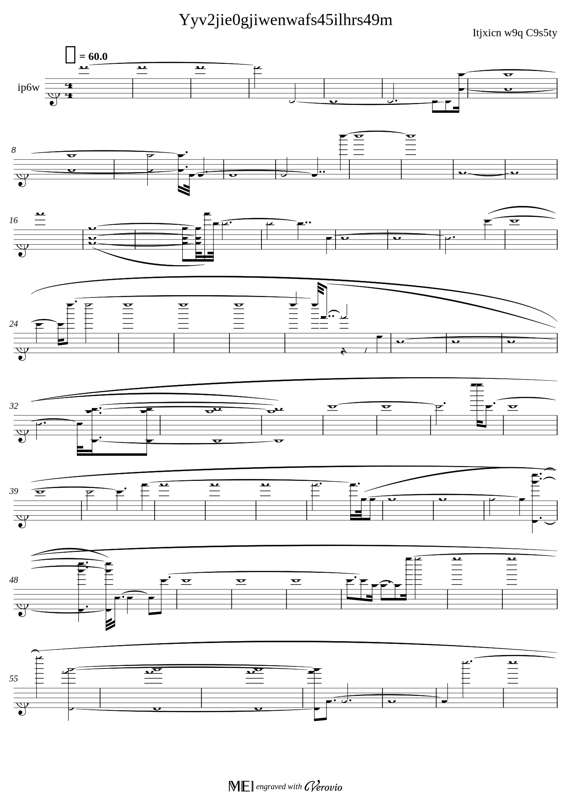
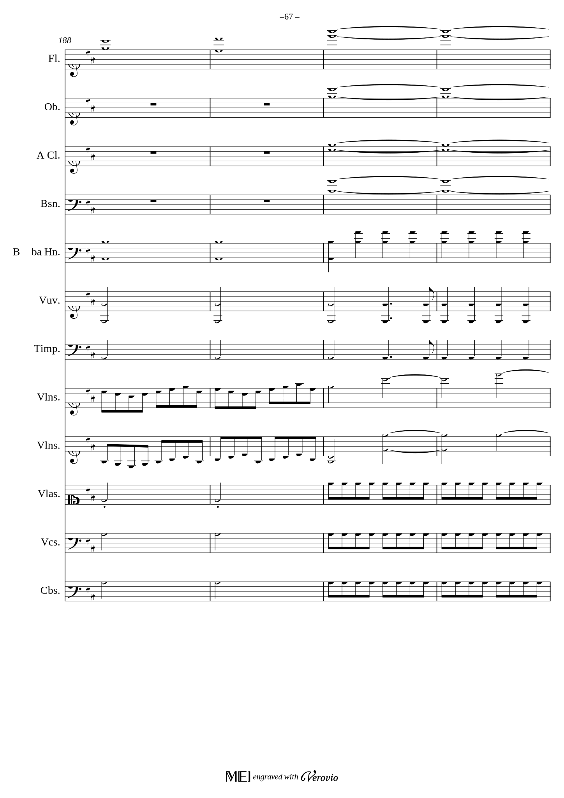

# Deep Learning Music Scores Restoration 🎼 🖥️

Topic: `Computer Vision` 
 
Type: `Image Generation / Image Transformation`

This project aims to restore damaged music scores using deep learning methods. 
We want to use **Autoencoders** & **Transformers** / **Convolutional Neural Networks** 
to perform several generativ AI tasks to **up-scale**, 
**de-blur** and **enrich** damaged music score into a cleaner and more readable form. 

### Dataset 

To train the model, we intend to generate a huge dataset of 'perfect' music scores by converting [MusicXML](https://de.wikipedia.org/wiki/MusicXML) 
files into images files using the [Verovio python interface](https://pypi.org/project/verovio/). 
Afterwards, we use some [image augmentation](https://albumentations.ai/) techniques or classic [image processing methods](https://pillow.readthedocs.io/en/stable/)
to 'damage' the music-score-images.

Since there are a lot of [open-source/ licence-free MusicXMLs](http://mscorelib.com/actree/) 
we can use them for the training. 
Furthermore, we intend to generate music sheets randomly to avoid overfitting. 
To generate the random data, we use the [Python SCAMP library](http://scamp.marcevanstein.com/index.html).  

Using the Verovio library, we start with generating SVG images from MusicXML files:
On the left, we provided an example of a random generated music sheet (we have to fine tune the chances, though) and on the right a real one 
(random page of the Don Giovanni Overture by Mozart generated from the [MusicXML file](examples/Mozart-Don_Giovanni.xml))

        
    

### Training

Using the damaged and the non-damaged music scores of the training set, 
we will train a model on the 'perfect' scores and use the damaged ones as input.
We aim to combine several different approaches to denoise the images ([Autoencoders](https://www.researchgate.net/publication/356423394_Denoising_Text_Image_Documents_using_Autoencoders) ) 
and upscale / de-blur them 
([Hybrid Attention Transformer](https://arxiv.org/abs/2205.04437v3) / [Convolutional Networks](https://arxiv.org/abs/1501.00092) 
for super-resolution and de-blurring).
We intend to use PyTorch to combine / implement the method and train it end-to-end.

### Future Work
In the future, 
we think of fine-tuning the model using real scans of old used music sheets and brand-new ones.

## References
* [Denoising Text Image Documents using Autoencoders](https://www.researchgate.net/publication/356423394_Denoising_Text_Image_Documents_using_Autoencoders)
* [Denoising GitHub](https://github.com/Surya-Prakash-Reddy/Denoising-Documents)
* [Hybrid Attention Transformer for Image Super-Resolution](https://arxiv.org/abs/2205.04437v3)
* [HAT Github](https://github.com/XPixelGroup/HAT)
* [Image Super-Resolution Using Deep Convolutional Networks](https://arxiv.org/abs/1501.00092)
* [CNN Github](https://github.com/amanshenoy/image-super-resolution)

## Work Breakdown structure

In the following table we break down the tasks and the
estimated amount of time needed to complete them. 

| Task                  | Estimated Time         |
|-----------------------|------------------------|
| Research              | 2 Days                 |
| Dataset Generation    | 1 Day                  |
| Model Creation        | 3 Days                 |
| Model Training        | 1 Day (no work for me) |
| Model Evaluation      | 1 Days                 |
| Integration           | 2 Days                 |
| Report & Presentation | 1 Day                  |

### Disclaimer
This repository is created by Nicolas Bschor as part of 
the Applied Deep Learning course at the Technical University of Vienna.
